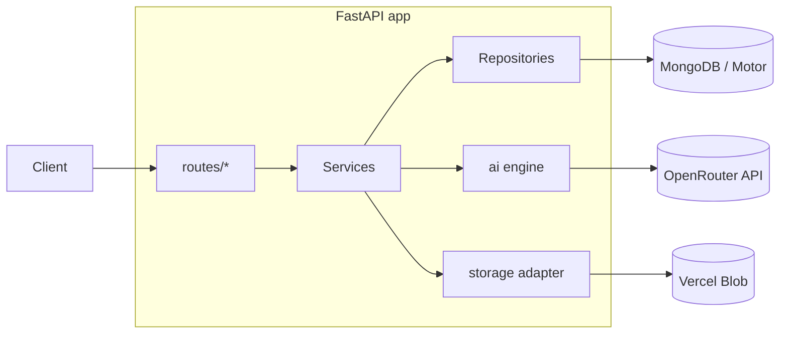

## Scope

In scope (backend only):

- Brand Kit CRUD (models + service + controller)
- Asset upload endpoint backed by Vercel Blob (logos)
- AI Email Generator (OpenRouter) with brand-kit-aware prompting
- Conversation persistence so follow-up prompts can edit the prior email
- Validation aligned with Requirements 6, 7, 8, 11

Out of scope (per user): authentication/sessions, user-id plumbing, frontend, test-email send, SSE streaming.

---

## Architecture




Layering:

- `routes/` — thin FastAPI controllers, request/response validation only
- `services/` — business logic, orchestration, validation rules
- `repositories/` — Motor queries, Mongo <-> domain dict mapping
- `models/` — Pydantic v2 schemas (DB docs + API DTOs)
- `ai/` — OpenRouter client, prompt builder, output sanitizer
- `storage/` — pluggable asset storage (Vercel Blob first, S3-ready interface)

---

## Dependencies (add to `[apps/api/pyproject.toml](apps/api/pyproject.toml)`)

- `httpx ^0.27` — OpenRouter + Vercel Blob HTTP calls (async)
- `pydantic ^2.9` — already transitively present via FastAPI; pin for v2 features
- `bleach ^6.1` — HTML sanitization defense in depth
- `python-multipart ^0.0.9` — multipart upload support for logo endpoint
- `tenacity ^9.0` — retry policy for OpenRouter calls

After adding, regenerate `[apps/api/requirements.txt](apps/api/requirements.txt)` via the existing `[apps/api/scripts/export_requirements.py](apps/api/scripts/export_requirements.py)` (already wired into `pnpm build`).

---

## Configuration changes (`[apps/api/app/config.py](apps/api/app/config.py)`)

Extend `Settings` with:

```python
openrouter_api_key: str = ""
openrouter_base_url: str = "https://openrouter.ai/api/v1"
openrouter_model: str = "anthropic/claude-sonnet-4.5"
openrouter_timeout_s: float = 60.0
openrouter_max_retries: int = 2

vercel_blob_token: str = ""           # BLOB_READ_WRITE_TOKEN
vercel_blob_api_url: str = "https://blob.vercel-storage.com"

ai_max_output_tokens: int = 8000
ai_temperature: float = 0.7
```

Add an example block to `apps/api/.env.example` (file may need creating if absent).

---

## Data model

Two Mongo collections: `brand_kits` and `email_conversations`.

### `brand_kits`

Fields enforce Requirement 6:

- `_id: ObjectId`
- `name: str` (required, 1–80 chars) — Req 6.6
- `website: HttpUrl | None`
- `summary: str | None` (max 1000)
- `address: str | None`
- `tone: Literal["neutral","formal","professional","inspirational","empathetic","playful","friendly"]` — Req 6.2 / 6.6
- `copyright_text: str | None`
- `footer_text: str | None`
- `disclaimers: str | None`
- `social_links: dict[str, HttpUrl]` (e.g. `{"twitter": "...", "linkedin": "..."}`)
- `logo_primary_url: HttpUrl | None`
- `logo_icon_url: HttpUrl | None`
- `colors: { background, container, accent, button_text, foreground }` — each a `#RRGGBB` validated via regex (Req 6.1)
- `created_at: datetime`, `updated_at: datetime`

Indexes: `{ name: 1 }` (non-unique for now since auth is skipped; later add compound `{ user_id: 1, name: 1 }`).

### `email_conversations`

Captures Req 11.2 (full history) and enables Req 8.5 (edits preserve unchanged sections):

- `_id: ObjectId`
- `brand_kit_id: ObjectId | None` — snapshot id at creation; service re-resolves per turn (Req 7.6)
- `messages: list[Message]` where `Message = { role: "user"|"assistant", prompt?: str, html?: str, edit_summary?: str, model: str, created_at }`
- `current_html: str | None` — denormalized latest assistant HTML for quick reads
- `created_at`, `updated_at`

Index: `{ updated_at: -1 }`.

---

## Module layout

```
apps/api/app/
  ai/
    __init__.py
    client.py          # OpenRouter httpx client (chat completions)
    prompts.py         # system + user prompt builders
    generator.py       # high-level generate() / edit() orchestration
    sanitizer.py       # bleach-based HTML safety pass
  storage/
    __init__.py
    base.py            # StorageBackend Protocol
    vercel_blob.py     # Vercel Blob implementation
  models/
    __init__.py
    brand_kit.py       # BrandKitCreate, BrandKitUpdate, BrandKitOut, BrandKitDoc
    conversation.py    # Message, ConversationDoc, ConversationOut
    email.py           # GenerateRequest, GenerateResponse, EditRequest
  repositories/
    __init__.py
    brand_kits.py
    conversations.py
  services/
    __init__.py
    brand_kits.py      # business rules, validation, orchestration with storage
    email_generator.py # orchestrates ai.generator + conversation persistence
  routes/
    health.py          # existing
    brand_kits.py      # NEW
    assets.py          # NEW (logo upload)
    emails.py          # NEW (generate + edit + fetch conversation)
```

Wire all new routers in `[apps/api/app/main.py](apps/api/app/main.py)`:

```python
app.include_router(brand_kits.router, prefix="/brand-kits", tags=["brand-kits"])
app.include_router(assets.router, prefix="/assets", tags=["assets"])
app.include_router(emails.router, prefix="/emails", tags=["emails"])
```

---

## Brand Kit module (Req 6, 7)

### Models (`models/brand_kit.py`)

- `BrandColors` — five `#RRGGBB` fields validated via `Annotated[str, StringConstraints(pattern=r"^#[0-9A-Fa-f]{6}$")]`
- `Tone` — `Literal[...]` of the 7 allowed values (Req 6.2)
- `BrandKitBase` — all optional fields
- `BrandKitCreate(BrandKitBase)` — requires `name` and `tone` (Req 6.6)
- `BrandKitUpdate` — all fields optional (PATCH semantics)
- `BrandKitOut` — adds `id: str`, `created_at`, `updated_at`
- `BrandKitDoc` — internal mapper to/from Mongo BSON (`_id` <-> `id`)

### Repository (`repositories/brand_kits.py`)

Async functions over `db["brand_kits"]`:
`create(doc) -> ObjectId`, `get(id)`, `list_(skip, limit) -> list`, `update(id, patch) -> doc`, `delete(id) -> bool`.

### Service (`services/brand_kits.py`)

- `create_brand_kit(payload)` — validates colors + tone, sets timestamps, calls repo
- `update_brand_kit(id, patch)` — 404 if missing, sets `updated_at`
- `delete_brand_kit(id)` — 404 if missing
- `list_brand_kits()` / `get_brand_kit(id)`
- `resolve_for_generation(id | None) -> BrandKitDoc | None` — used by AI engine; tolerates `None` (Req 7.5)

### Controller (`routes/brand_kits.py`)

REST shape:

- `POST /brand-kits` — body `BrandKitCreate` → 201 `BrandKitOut`
- `GET /brand-kits` — `?limit=&skip=` → `list[BrandKitOut]`
- `GET /brand-kits/{id}` → `BrandKitOut` or 404
- `PATCH /brand-kits/{id}` — body `BrandKitUpdate` → `BrandKitOut`
- `DELETE /brand-kits/{id}` → 204

Errors via `HTTPException`: 400 (validation), 404 (not found).

---

## Asset upload (`routes/assets.py`, `storage/`)

Supports the two logo URL fields in the brand kit (Req 6.1) without forcing the user to host images themselves.

### Storage abstraction (`storage/base.py`)

```python
class StorageBackend(Protocol):
    async def put(self, *, key: str, data: bytes, content_type: str) -> str: ...
```

Returns a public URL.

### Vercel Blob impl (`storage/vercel_blob.py`)

- Use `httpx.AsyncClient`
- `PUT https://blob.vercel-storage.com/{pathname}?...` with `Authorization: Bearer {BLOB_READ_WRITE_TOKEN}` and `x-content-type` header
- Random suffix add-on (default Vercel Blob behavior) keeps keys unique
- Parse JSON response and return `url`
- Reference: Vercel Blob REST upload endpoint

### Endpoint

- `POST /assets/logo` (multipart/form-data, field `file`) → `{ url: str }`
- Validate: content-type starts with `image/`, max size 5 MB
- Returns the Blob URL the client then writes into `BrandKit.logo_primary_url` or `logo_icon_url`

---

## AI engine (`ai/`)

### Prompt builder (`ai/prompts.py`)

Two helpers:

- `build_system_prompt(brand_kit: BrandKitDoc | None) -> str`
  - Hard rules: produce a single complete HTML document, table-based layout, inline CSS only, max width 600px, fallback fonts, no `<script>`, no external CSS, support dark-mode-safe colors, alt text on images. (Req 8.3)
  - When `brand_kit` is provided: inject palette, tone, logos, footer, copyright, disclaimers, social links as structured context (Req 8.2)
  - Output contract: respond with **only** raw HTML between `<!DOCTYPE html>` and `</html>` — no markdown fences, no commentary
- `build_edit_system_prompt(brand_kit, prior_html) -> str`
  - Includes prior HTML verbatim
  - Instruction: "Apply the user's edit. Preserve every section the edit does not reference. Return the full updated HTML." (Req 8.5, Req 11.4)
  - Asks for a one-line `<!-- edit_summary: ... -->` HTML comment at the top so we can extract a human-readable change note

### OpenRouter client (`ai/client.py`)

- Single `OpenRouterClient` class wrapping `httpx.AsyncClient`
- `POST {base_url}/chat/completions` with headers `Authorization: Bearer {key}`, `HTTP-Referer`, `X-Title: "Notification API"`
- Body: `{ model, messages, temperature, max_tokens }`
- Wrap in `tenacity` retry: max 2 attempts, exponential backoff, retry on 429/5xx/network only
- Return assistant message string

### Sanitizer (`ai/sanitizer.py`)

- Use `bleach.clean` with an allowlist sized for email HTML (`html`, `head`, `body`, `table`, `tr`, `td`, `tbody`, `thead`, `style`, `a`, `img`, `p`, `div`, `span`, `strong`, `em`, `h1`–`h6`, `ul`, `ol`, `li`, `br`, `hr`, `meta`, `title`)
- Strip `<script>` and event handler attributes (`on`*)
- Defense in depth: even if the model misbehaves, output stays safe to render in an iframe

### Generator (`ai/generator.py`)

```python
async def generate_email(prompt: str, brand_kit: BrandKitDoc | None) -> GeneratedEmail: ...
async def edit_email(prompt: str, prior_html: str, brand_kit: BrandKitDoc | None) -> GeneratedEmail: ...
```

`GeneratedEmail` = `{ html: str, model: str, edit_summary: str | None, usage: {...} }`.

Steps for both:

1. Build system + user messages
2. Call `OpenRouterClient.complete(...)`
3. Strip accidental markdown fences (

```html ...

```)
4. Validate it parses as HTML and starts with `<!DOCTYPE` or `<html`; if not, retry once with a stricter "raw HTML only" reminder
5. Run `sanitizer.clean(html)`
6. Extract `edit_summary` comment if present
7. Return `GeneratedEmail`

---

## Conversation + email orchestration

### Repository (`repositories/conversations.py`)

`create() -> id`, `get(id)`, `append_message(id, message)`, `update_current_html(id, html)`.

### Service (`services/email_generator.py`)

Two entry points:

- `start_conversation(prompt, brand_kit_id) -> (conversation_id, GeneratedEmail)`
  - Resolve brand kit via `brand_kits.resolve_for_generation` (Req 7.5: None is allowed)
  - Call `ai.generator.generate_email`
  - Persist conversation with two messages (user + assistant), `current_html` set
  - Return ids + html

- `continue_conversation(conversation_id, prompt, brand_kit_id) -> GeneratedEmail`
  - Load conversation; 404 if missing
  - Re-resolve brand kit each turn (Req 7.6 — switching kit mid-session takes effect on subsequent generations)
  - Call `ai.generator.edit_email` with `prior_html = conversation.current_html`
  - Append both messages, update `current_html`

### Controller (`routes/emails.py`)

- `POST /emails/generate` — body `{ prompt: str, brand_kit_id?: str }` → `{ conversation_id, html, edit_summary, model }` (Req 4.4 / 4.5 / 8.1 / 8.4)
- `POST /emails/{conversation_id}/edit` — body `{ prompt: str, brand_kit_id?: str }` → same response (Req 8.5 / 11.1 / 11.3)
- `GET /emails/{conversation_id}` → full conversation with message history (Req 11.2)

Validation:
- `prompt` non-empty, max 4000 chars
- `brand_kit_id` if present must be a valid `ObjectId`; 404 if not found
- 502 if OpenRouter ultimately fails after retries, with the upstream error code logged

---

## Cross-cutting concerns

- **Async DB access**: keep using Motor; add a `get_db` FastAPI dependency in `[apps/api/app/db.py](apps/api/app/db.py)` so repositories receive the database via DI (testable).
- **Index creation**: add a `lifespan` step in `[apps/api/app/main.py](apps/api/app/main.py)` that creates indexes idempotently on startup.
- **Error handling**: a small `app/errors.py` with `NotFoundError`, `ValidationError`, `UpstreamError` plus an exception handler that maps to HTTP codes — keeps controllers clean.
- **Logging**: `logging.getLogger("app.ai")` around OpenRouter calls (model, latency, token usage, retry count). No prompt content at INFO level.
- **Secrets**: never log `openrouter_api_key` or `vercel_blob_token`. Both come from env only.
- **Lint**: existing Ruff config covers new files; run `pnpm lint` after.

---

## Verification (manual, no auth needed)

1. `pnpm --filter api dev`
2. `curl -X POST localhost:8000/brand-kits -H 'content-type: application/json' -d '{ "name":"Acme", "tone":"professional", "colors":{"background":"#ffffff","container":"#f7f7f7","accent":"#ff6600","button_text":"#ffffff","foreground":"#111111"} }'`
3. `curl -X POST localhost:8000/emails/generate -H 'content-type: application/json' -d '{ "prompt":"Welcome email for a new user named Alex", "brand_kit_id":"<id>" }'`
4. `curl -X POST localhost:8000/emails/<conv_id>/edit -H 'content-type: application/json' -d '{ "prompt":"Change the CTA color to red and shorten the intro" }'` — confirm unchanged sections preserved (Req 8.5).
5. `curl -F file=@logo.png localhost:8000/assets/logo` — confirm Vercel Blob URL returned.
```

